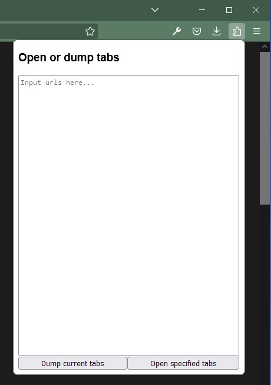
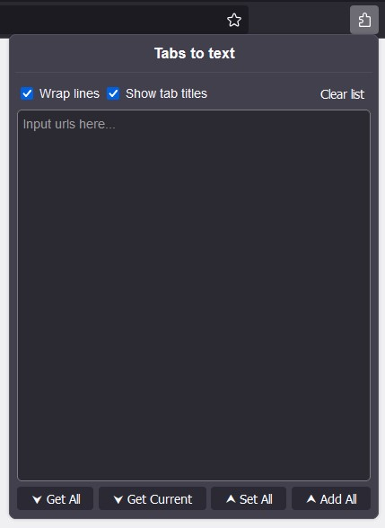

#  Tab dump extension

Simple yet powerful browser extension for Firefox that let user dump and open tabs from text.
Extension can be used in many different user scenarios thanks to the universal text format.

## Overview & Manual

### Dumping tabs
The extension allows to retrieve either all or just current opened tab in the current browser window. The list of all opened tabs can be dumped by pressing the "Get All" button from the GUI. Dumping just currently opened tab can be done by utilizing the "Get Current" button. In both cases, the result will be shown in the text field in the GUI. The results can be manipulated by using functions above the text field. Those are described in the [text modification](#text-modification) section.

*List of dumped tabs*

### Opening tabs
The extensions allows also to open list of tabs by either overriding all already opened tabs, or just adding to them. Opening the list of tabs starts by creating the list of tabs to be opened. It is composed with the help of the text field in the GUI where some text formatting rules apply. These are described in detail in the [text formatting](#text-formatting) section. When the list of the tabs to be opened is composed, there are two different ways they can be opened. To open and simultaneously close all the other opened tabs, the "Set All" button should be utilized. To open them without closing other tabs, the "Add All" button should be utilized instead.

In addition all tabs are opened in "discarded" mode, which means that theirs content is not loaded until they become active. This approach allows to save resources while loading big set of tabs.

*Extension's GUI*

### Text modification
#### Wrap urls
"Wrap urls" is a function that toggles text wrapping in the text field. When text wrapping is turned on, lines that exceeds text field width will be wrapped and continued on "next" line. When it is turned off, text will continue to appear in the same line even when text field width is exceeded. In such case, a scrollbar appears that allows to see all of the text. This function however does not modify the actual structure of the text (i.e adding line breaks), it only affect text visually. This function may become handy in case of longs links. By turning urls wrapping off, each link is presented visually in new line which improves visibility. 

#### Show tab titles
"Show tab titles" is a function that allows to show tab titles together with tab urls. By turning this function on, list of currently opened tabs will include titles of such tabs. Titles will be presented in form of comments above relevant url.

### Text formatting
As extension supports text format, user is technically free to enter anything as input. Because of that, the extension is made so it can handle most of the text formatting, but keep it in mind that it can still fail. A safe format for opening tabs is when each link is presented on a new line. Other formats should also work, the important factor is that each link should be separated with a white space such as space or new line.

In addition links should be fully-qualified meaning that they should contain a protocol ("www.example.com" - ❌ bad "https://www.example.com" - ✅ good). The extension should be capable of prepending a default protocol ("https://") if missing, but it is recommenced to include it from the start. Note that there are some [restricted protocols](#restricted-protocols) which means that the extension will not be able to handle tabs/urls containing them. 

#### Comments
Comments in url list are supported. In order to create a commented line, it must start with "#" character. If comment spans across multiple lines, then each line should start with "#" character. Lines that are not comments will be treated as links.

### Restricted protocols
Some protocols are restricted from being opened by extensions. This is something you can read more about here: https://developer.mozilla.org/en-US/docs/Mozilla/Add-ons/WebExtensions/API/Tabs/create. This directly affect this extensions and therefore it is not capable of handling some of the protocols. Currently restricted protocols are: "chrome:", "javascript:", "data:", "file:", "about:". If you present any of those to the extensions, then it will simply ignore it. This means that you will not be able to open and retrieve tabs such as i.e (about:performance).

## Installation:
Available for Firefox via: https://addons.mozilla.org/firefox/addon/tab-dump/

In addition you also install it as local debug install. **Note that you will have to install it every time you open the browser**
- [Installing extension locally](https://developer.mozilla.org/en-US/docs/Mozilla/Add-ons/WebExtensions/Your_first_WebExtension#installing)

## Bugs & To do
See issues on this repo

