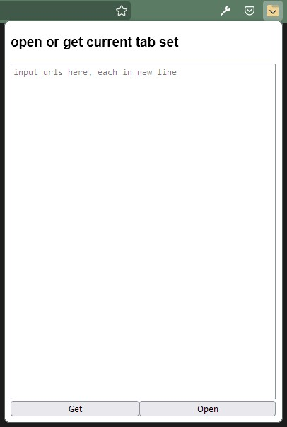

#  Tab dump extension

Browser extension for Firefox that let user save and load set of tabs from text file. 

## Overview

Extension implements a simple GUI where the user can either enter or retrieve list of tabs. The GUI consist of two buttons; "Get" and "Open" and one text area where data is either returned or entered. Clicking on "Get" button in GUI will return list of tabs in current window to textarea. Clicking on "Open" in GUI will open each entered URL in text area as a separate tab.

*Extension's GUI*

## Installation:
Currently this under initial development and therefore it is not published yet. However it can be installed in form of local debug version.

## To do
Address To do's in source code.